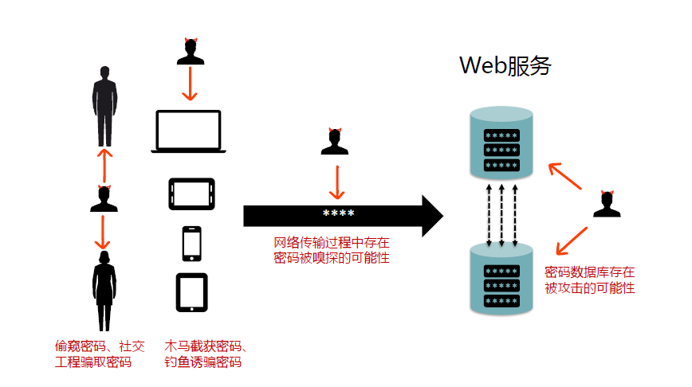
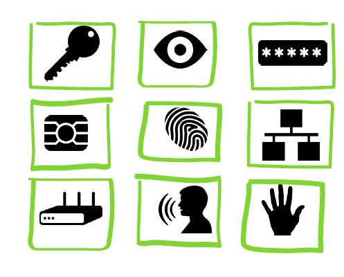
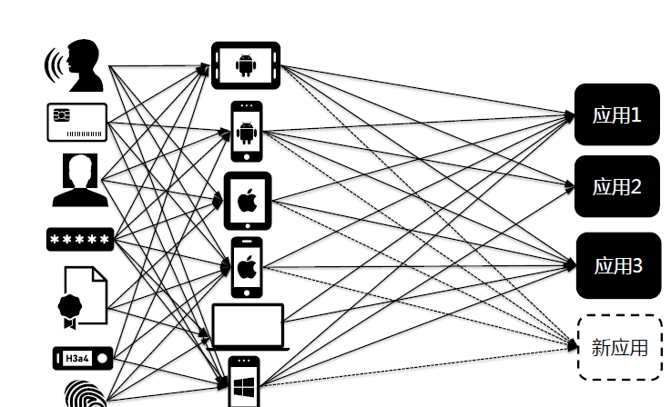
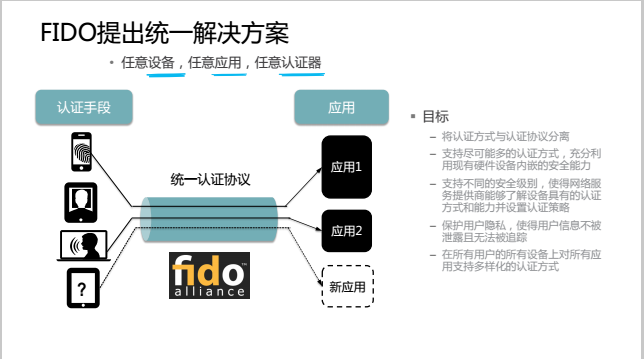

# Fido 综合阐述  

  1. ## fido 的基本概念
     1.  [fido 产生之前的情况](#1.1)
     2.  [fido 的概念](#1.2)
     3.  [fido 联盟](#1.2)
     4.  [fido 分类](#1.3) 
   
  2. ## fido 的产生之前认证方式的弊端
     1. [传统方式的弊端](#2.1) 
     2. [认证方式泛滥的灾难](#2.2)
      
  3. ## fido 的优势所在
     1. [fido 的设计理念](#3.1)
     2. [fido 的统一性](#3.2)
     3. [fido 的安全性](#3.3)
     

<h2 id="1">fido 的基本概念</h2> 
   <h3 id="1.1">fido 产生之前的情况</h3>fido产生之前，我们能想到的最平常的一种认证用户的方式就是：密码认证。但是，随着模式识别的技术和传统密码暴露的诸多缺陷问题的出现，人们想到了指纹，声音，脸型等认证方式，来代替密码的认证方式，然而纷乱的方式也存在巨大的问题（之后阐述）
   <h3 id="1.2">fido的概念</h3>
   
   什么是fido呢？fido实际是一种安全通信的协议的代表，这份协议由是fido联盟的创始人起草的。
    **fido联盟：**FIDO Alliance，成立于2012年7月。FIDO的会员包括Nok Nok Labs、Google、BlackBerry、ARM、英特尔、PayPal、Lenovo、MasterCard、三星、VISA、Synaptics、RSb、微软等等。支付宝也于今年9月份左右加入的FIDO组织。
    FIDO的目标是创建一套开放的标准协议，保证各个厂商开发的强认证技术之间的互操作性，改变目前的主流在线验证的方式（即使用密码作为主要验证手段），消除或者减弱用户对密码的依赖。对于互联网公司来说，随着重大数据泄露事故的频发，过去基于密码的在线身份验证技术已经难以维持互联网经济的稳定发展，安全界关于"密码已死"的呼声越来越高。而FIDO联盟正是在这个背景下应运而生的一个推动去密码化的强认证协议标准的组织。
   <h3 id="1.3">fido 协议分类</h3>
   fido协议分为UAF和UAF两种协议：   
    *    UAF 支持指纹、语音、虹膜、脸部识别等生物身份识别方式。无需用户密码（Passwordless）介入，直接进行验证交易。用户在注册阶段，根据服务器支持的本地验证方式，选择一种验证方式，如：指纹识别，人脸识别，语音识别，等等，服务器也可保留密码验证方式，将密码和生物识别相结合，增强账户安全性。
    *    
    *    U2F类似国内的二代U盾的保护机制，使用双因子（密码和能与用户交互的设备）保护用户账户和隐私。用户在注册阶段，使用服务器支持的加密设备，将账户和设备绑定。当进行登录验证操作时，服务器在合适的时候，提示用户插入设备并进行按键操作，加密设备对数据签名，发送给服务器，服务器做验证，如果验证成功，用户则可登录成功。由于有了第二因子（加密设备）的保护，用户可以选择不设置密码或者使用一串简单易记的4位密码。
     
   
   

<h2 id="2">fido 的产生之前认证方式的弊端</h2>
  <h3 id="2.1">2.1 传统方式的弊端</h3> 
   * 传统密码安全模型存在以下弊端： 
      1. 对用户而言，密码不容易记忆是一种很痛苦的问题。
      2. 使用传统密码体系结构容易受到攻击，无论是客户端，还是服务器端：
         * 客户端：存在密码容易偷窥，终端受到木马病毒，
         * 传输过程：传输过程中容易收到攻击
         * 服务器：服务器的密码数据库容易受到攻击
      

  * 传统的弊端，如图所示：
      *   
     
    
  <h3 id="2.2">认证方式泛滥的灾难</h3> 
   *  其实在fido产生之前，人们已经有各种各样的解决方案来代替这种比较简单的认证方式了，比如指纹，虹膜，脸型，IC卡等基于人体特征认证方式，来使得认证变得可靠和简单。
       * 截图如下所示：
       * 
       * 这样的方式确实可以解决密码认证的存在的诸多不好的问题，但是由于认证方式的多样性的产生，导致了不同的认证设备，不同的客户端,不同服务器都要进行开发。加之应用类型变多之后，形成了开发难度和开发数目上难以维护的窘况：
       * 这种认证方式的带来的问题的用图片更容易描述：
       * 
       
        
  <h2 id="3">fido 的优势所在</h2>
   <h3 id="3.1">fido 的设计理念</h3>fido其实是在多种创新的认证方式发明之后的一个统一的认证方式。fido联盟起草fido协议的主要目的就是要将fido用来统一这种纷乱的认证方式，解决认证方式繁多带来的复杂性。
   <h3 id="3.2">fido 的统一性</h3> 
   *  将认证方式与认证协议分离
   *  支持尽可能多的认证方式，充分利用现有硬件设备内嵌的安全能力
   *  支持不同的安全级别，使得网络服务提供商能够了解设备具有的认证
方式和能力并设置认证策略 
   *  在所有用户的所有设备上对所有应用支持多样化的认证方式
   *  
   
  <h3 id="3.3">fido 的安全性</h3> fido摒弃了传统的密码认证方式，采用基于人体特征的方式进行安全认证。这样对安全性带来的好处有: 
   
   *  解决了密码琐碎，难以记忆，也解决了密码偷窥的问题。
   *  验证了用户的在认证过程中的真实身份和有效性。
   *  使得攻击者在客户端和服务器传输的过程中形成攻击无效（即使拿到了数据也是无用的）
   *  服务器不再存储用户名和密码的键值对,,就算遭到攻击，数据库泄露，也不会造成密码直接泄露给攻击者的问题.
  
    
     

