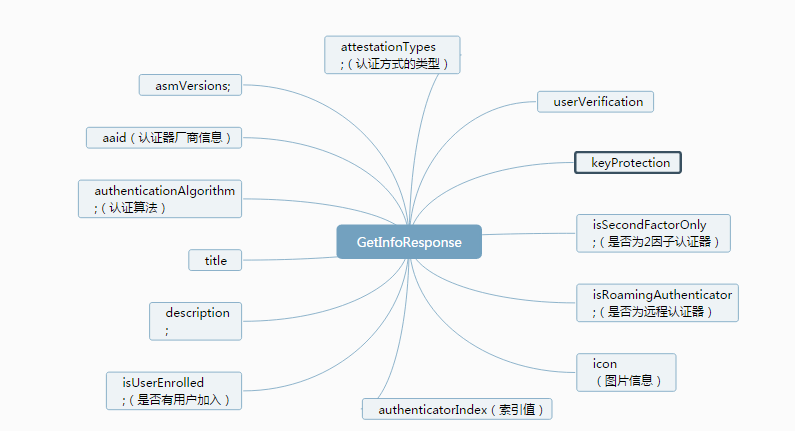
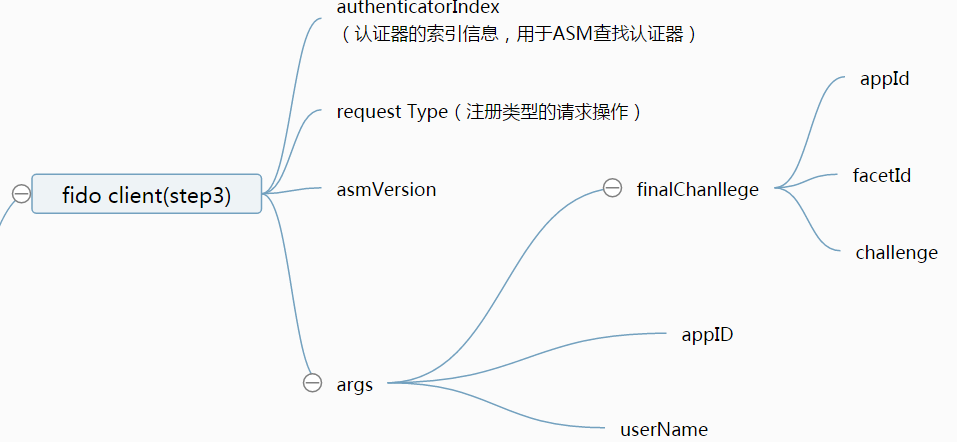
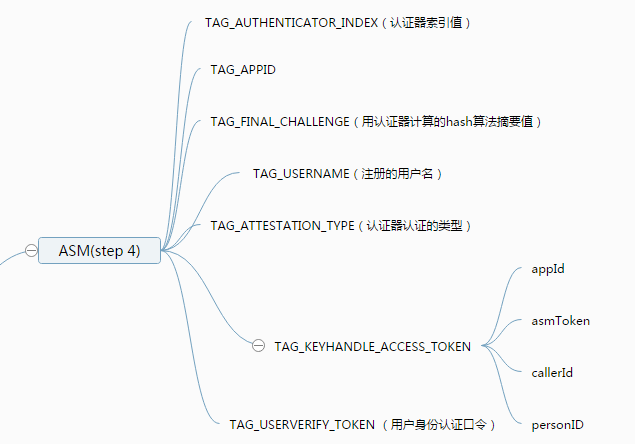
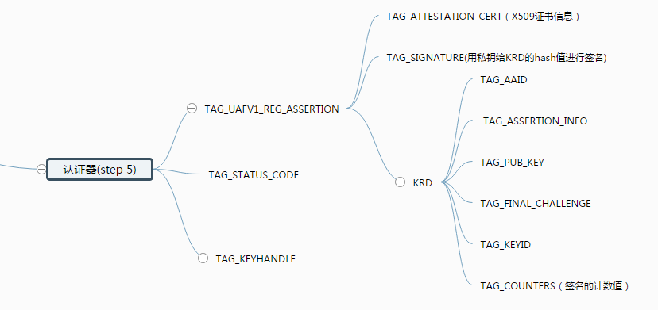
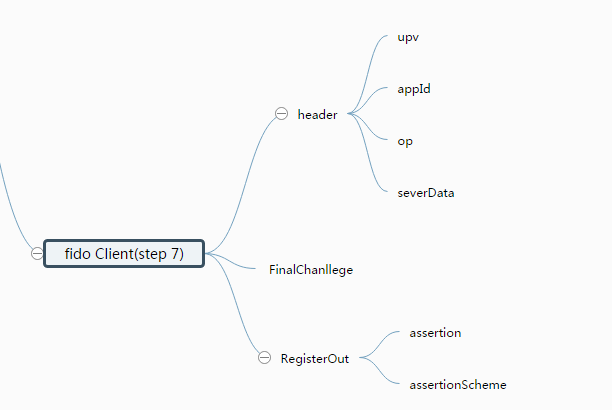

# fido 操作流程阐述 

  1. ## [GetInfo操作](#1.1)
    1. [GetInfo操作的目的](#1.1)
    2. [GetInfo操作具体步骤程以及数据演变](#1.2)
       * [1.Fido Client](#1.2.1)
       * [2.ASM](#1.2.2)
       * [3.认证器](#1.2.3)
       * [4.ASM](#1.2.4)
       * [5.Fido Client](#1.2.5)

  2. ## [Register操作](#2.1)
     1. [Register操作的目的](#2.1)
     2. [Register操作具体流程以及数据演变](#2.2)
       * [1.Fido Client](#2.2.1)
       * [2.Fido Server](#2.2.2)
       * [3.Fido Client](#2.2.3)
       * [4.ASM](#2.2.4)
       * [5.认证器](#2.2.5)
       * [6.ASM](#2.2.6)
       * [7.Fido Client](#2.2.7)
       * [8.Fido Server](#2.2.8)
       
  3. ## Authenticate 操作流程
    1. Authenticate操作的目的 
    2. Authenticate操作具体流程以及数据演变
       * 1.Fido Client
       * 2.Fido Server
       * 3.Fido Client
       * 4.ASM
       * 5.认证器
       * 6.ASM
       * 7.Fido Client
       * 8.Fido Server

  <h2 id="1.1">1.GetInfo操作</h2>
  <h3 id="1.1">1.1 GetInfo操作的目的</h3>GetInfo操作的目的是为了获取认证器的详细信息，为什么要获取认证器的详细信息呢？因为一个设备上，可能集成了很多个认证器（比如指纹认证器，声音认证器，虹膜认证器等），这时候，用户一次只能使用一种认证器来进行fido认证，那么，FidoClient需要根据服务器的policy来决定使用哪种认证器，继而在之后数据传递操作中，告诉ASM选择哪种认证器做后续的操作流程。

  Fido Client: FidoClient每次在收到fidoServer的Request的信息之后，都会解析policy字段，具体操作流程如下所示： 我们可以看到，Fido Client会根据服务器的policy和获取本地认证器的信息来进行后续的步骤
 
  <h3 id="1.2">1.2 GetInfo操作具体步骤程以及数据演变的</h3>
   1. <h5 id="1.2.1">Fido Client:</h5>首先FidoClient收到服务器的消息后，向 ASM发出获取Info的请求，这个请求体的格式为： 
   2. <h5 id="1.2.2">ASM:</h5>ASM收到请求消息后，做如下操作：
     * 1.首先列举出在该设备上且ASM支持的认证器
     * 2.向所有的认证器发送GetInfo指令
     * 向ASM发送信息的结构截图所示：
   3. <h5 id="1.2.3">认证器:</h5>认证器收到GetInfo的请求后，生成GetInfo返回体，然后把认证器的详细信息返回给ASM
   4. <h5 id="1.2.4">ASM:</h5>ASM收到信息后，基本不做过多处理，简单组织信息后，直接返回给FidoClient,返回的信息体如下
   5. <h5 id="1.2.5">Fido Client:</h5>Fido Client收到信息之后，会将服务器的policy中的信息和认证器信息进行匹配，找到匹配成功的认证器后，将authenticatorIndex加入请求ASM的消息体中。

 
 <h2 id="2.1">2.Register操作</h2>
   <h3 id="2.1">2.1 Register操作</h3>注册操作主要是为用户的认证操作做准备。在注册操作中，认证器会生成之后认证过程最关键的公私钥对，KeyHandle，KeyId等重要数据，为之后的认证过程能够认证用户身份做数据铺垫。
    
   <h3 id="2.2">2.2 Register操作具体流程以及数据演变
     1. <h5 id="2.2.1">1.Fido Client:</h5> fidoClient首先会发送如下图的信息给Fido Server：
     2. <h5 id="2.2.2">2.Fido Server</h5>Fido Sever收到请求后，组织如下数据信息，发送给Fido Client（注：由于本篇文档是主要阐述关于客户端的，因此，服务器如何组织信息，客户端这里不做解释） 我们可以看到，服务器的信息包含：header[upv,severData,op],policy[accpted,disallow],AppId,challenge的信息.
     3. <h5 id="2.2.3">3.Fido Client</h5> FidoClient 收到第2步的信息后，做如下操作:
      
  * 1.用json解析upv中的major version和minor versionn是否1，0；
  * 2.用json解析服务器发送的全部信息
  * 3.根据消息中的policy字段来筛选符合的认证器：具体的筛选步骤如下：
       * 解析policy里面的信息（policy里面的信息都是FidoServer认可的，用户可以注册的认证器）
       * 根据最近较常使用的认证器来选择policy信息里面的组合
       * 搜集所有可用的认证器信息
       * 排除policy.disallowed的信息
       * 找到匹配policy.accepted中包含的认证器
       * 引导用户使用匹配成功的认证器（让用户选择匹配成功的认证器）
 *  4.根据AppID来获取FacetId，具体的操作如下：
       * 1.
       * 2.
       * 3.
 *  5.形成FinalCallengeParams的内容，FinalCallengeParams就是appID 和challenge,facetIdf的json字符串的信息(Base64b编码形成的)
 *  6.形成下图所示的信息，发送请求信息，发送给ASM： 我们可以看到，包含的信息包括（认证器索引信息，操作类型，ASM版本号，请求参数[finalChallege,appID,userName]）
 
   
   <h5 id="2.2.4">4.ASM</h5>
  ASM收到请求的信息体后，做如下的操作：
  
  1. 根据authenticatorIndex找到对应的认证器，如果索引值没有找到对应的认证器，则返回错误的状态码
  2. 如果认证器中已经有用户的身份特征信息了，则要求要求认证器验证用户的身份，并且生成UserVerificationToken字段（如果认证器支持这个字段的话）；如果认证器验证用户身份失败，则返回拒绝的状态代码。
  
  3. 如果认证器中并未含有用户的身份特征信息，则要求认证器现在录入用户身份特征信息
  4. 生成KeyHandleAccessToken的数值
      * 1.KeyAccessToken=AppID
      * 2.如果为绑定类的认证器则：KHAccessToken |= ASMToken | PersonaID | CallerID(注：其中，ASMToken是ASM的一个特征数值，PersonID是操作系统用户名，CallerID是调用FidoClient的APP的包名)
      * 3.计算KHAccessToken的hash数值，摘要算法是认证器内部的摘要算法:KHAccessToken=hash(KHAccessToken)
  5. 计算FinalChanllege的摘要数值（hash算法应该用认证器自己的hash算法）
  6. 生成如下图信息（TLV格式）发送给认证器：
  可以看到上图的信息包括（认证器索引值，APPID，挑战的摘要值，注册的用户名，认证器的认证方式，KHAceesToken）
  
  <h5 id="2.2.5">5.认证器</h5> 认证器收到ASM的请求体之后，做如下操作： 
 
   1. 如果APPID的字段不为空，则再次更新KeyAceessToken的数值 KHAccessToken=hash(KHAccessToken | Command.TAG_APPID)
   
   2. 如果认证器中已经含有了用户的身份特征信息（比如用户的指纹，声音等类型的信息），验证用户的身份的合法性。如果TAG_USERVERIFY_TOKEN字段不为空，则验证TAG_USERVERIFY_TOKEN字段的合法性；如果认证失败，则返回拒绝的响应状态码。  
   3. 如果认证器中没有没用用户的信息，则当场让认证器记录用户的身份特征信息，如果用户取消记录，则返回取消的状态码，如果记录失败，则返回拒绝的状态代码。
   4. 确保TAG_ATTESTATION_TYPE 是认证器支持的类型，否则返回不支持的响应的代码
   5. 以上操作都没有问题之后，产生一个密钥对(公私钥)
   6. 生成RawKeyHandle:
    * .将私钥加入RawKeyHandle对象
    * .将TAG_KEYHANDLE_ACCESS_TOKEN 加入RawKeyHandle对象
    * .如果是第一类认证器，KeyHandle还要加入用户名字
   7. 对RawKeyHandle进行加密(加密方式由认证器决定）(AES加密算法)
   8. 形成KRD的内容：（以TLV的形式）KRD的内容如下图所示： KRD[AAID,ASSERTION_INFO,FINAL_CHALLENGE,KEY_ID,COUNTERS,PUBLIC KEY]（注：如果是二因子非绑定类型的认证器，则用KeyHandle代替KeyId）
   9. 按照协议规范组织KRD的内容
   10. 生成签名证书TAG_AUTHENTICATOR_ASSERTION的内容：
      * 生成KRD的摘要信息，并且用私钥对KRD进行签名。
      * 如果是第一类认证器，则会把keyHandle发给ASM保存，如果是
      * 加入X509的证书信息
      * 按照TLV的形式组织TAG_AUTHENTICATOR_ASSERTION的内容
   11. 将KRD和TAG_AUTHENTICATOR_ASSERTION按照TLV的形式返回给ASM，数据信息如下：
   
 <h5 id="2.2.6">6.ASM</h5>ASM收到认证返回的信息之后，做如下操作：
  
 1. 解析TAG_AUTHENTICATOR_ASSERTION消息体，提取出KEY_ID的的数值
 2. 如果认证器是绑定类型的认证器，则将CallerID,AppID,TAG_KEYHANDLE,TAG_KEYID,当前系统时间存入ASM的数据库中。
 3. 构造向FidoClient向上传递的信息体，如下图所示
 
 <h5 id="2.2.7">7.Fido Client</h5>Fido Client收到ASM的返回的消息体之后，做如下处理： 
   
   构造向FidoServer返回的消息体
   
  * 构造头部信息：就是服务器一开始发过来的头部信息header[upv,severData,op]
  * 从ASM返回的消息体中，提取出FINAL_CHALLENGE的信息，然后加入fcParams 中
  * 将ASM返回的消息体中的ASSERTION加入RegisterOut的内容中
  * 形成如下图所示的消息体：
  * 将消息体发送给Fido Server

 <h5 id="2.2.8">8.Fido Sever</h5>FidoSever做后续处理，比如存储KeyID，验证签名是否正确等等
     
  <h2 id="3.1">3.Authenticate操作</h2>
   <h3 id="3.1">3.1 Authenticate操作的目的</h3>认证操作的主要目的是在注册操作已经完成
   <h3 id="3.2">3.2 Authenticate操作具体流程以及数据演变</h3>认证过程中每一步的操作以及每一层做的具体的事情如下所示
   <h5 id="3.2.1">1.Fido Client</h5>Fido Client向服务器发送验证的请求，请求内容包含userName。
   <h5 id="3.2.2">2.Fido Server</h5>Fido Server组织信息如下图所示（由于本文档主要面向客户端，因此server如何组织的信息，这里略去）
    可以看到，fidosever发送的信息中，含有header[upv,severData,op],challenge,policy[accpeted[keyid,aaid],disallow],其中，keyID和AAID是在注册过程认证器留在服务器上的信息（注：keyID和AAID的组合一定是唯一的）
   <h5 id="3.2.3">3.Fido Client</h5>FidoClient收到FidoServer的消息后，作如下操作：
    
   * 用json解析信息服务器的报文体
   * 根据AppID获取到faceID：

       *  如果
       *  如uo
       *  如果
      
   * 根据policy的信息，筛选出符合的认证器:
      * 根据经常使用的认证器信息来选择policy.accpted的中的组合信息
      * 搜集所有可用的认证器信息
      * 如果有认证器的信息在policy.disallowed中，则忽略这些信息
      * 根据policy中的信息来匹配认证器的信息
      * 
      
   * 找到匹配的认证器后，让用户选择用户想使用的认证器(authenticatorIndex)
   * 
       

   
