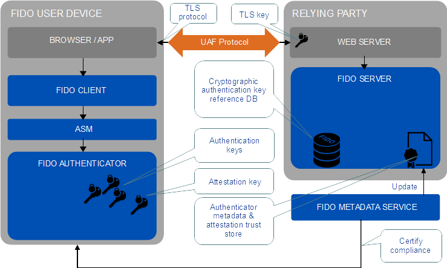

# Fido架构阐述

  1.  ##[1.总体架构](#1.1)
       1. [1.1 总体架构](#1.1)
       2. 1.2 总体流程阐述
  2.  ##2.fido sever
  
  3. ## 3.fido Client
      1.  3.1 fido client 概述
      1.  3.2 fido Client 同服务器交互
      2.  3.3 fido Client 同ASM 交互
             
  4.  ## 4.fido client ASM
     1. fido client ASM 概述   
     1. fido client ASM 同fido Client交互
     2. fido client ASM 同 fido 认证器交互
     
  5. ##5. 认证器
     1. fido client 认证器概述
     2. fido client 认证器同 fido client ASM 的交互
     3. 认证器返回的信息同服务器的关联
  
    

  <h2>1.总体架构</h2>
   <h3 id="1.1">1.1总体架构</h3>fido协议基于传统的client-sever结构，如下图所示从服务器从服务器端分为至上而下分为WebSever，FidoServer，FidometeDataSever，客户端至上而下分为Fido Client，ASM，Fido认证器。 接下来依次解释每一层的作用：
   
   * WebSever：一个传统的web服务器层，主要进行负责对监听client端的请求，并将数据交给fido Sever，同时会将fido Sever的数据返沪给client端，封装了fido sever，使之成为一个web服务器的形式
   * FidoServer：一个fido服务器，主要负责对客户端的产生的各种用户数据和安全信息做逻辑处理操作，并做数据存储；同时关联fidometaSever，做安全性认证。
   * FidoMetaDataSever：一个fido官方的安全性认证的服务器，比如验证fido认证器的类型；认证fido认证器包含的证书是否正确。
     